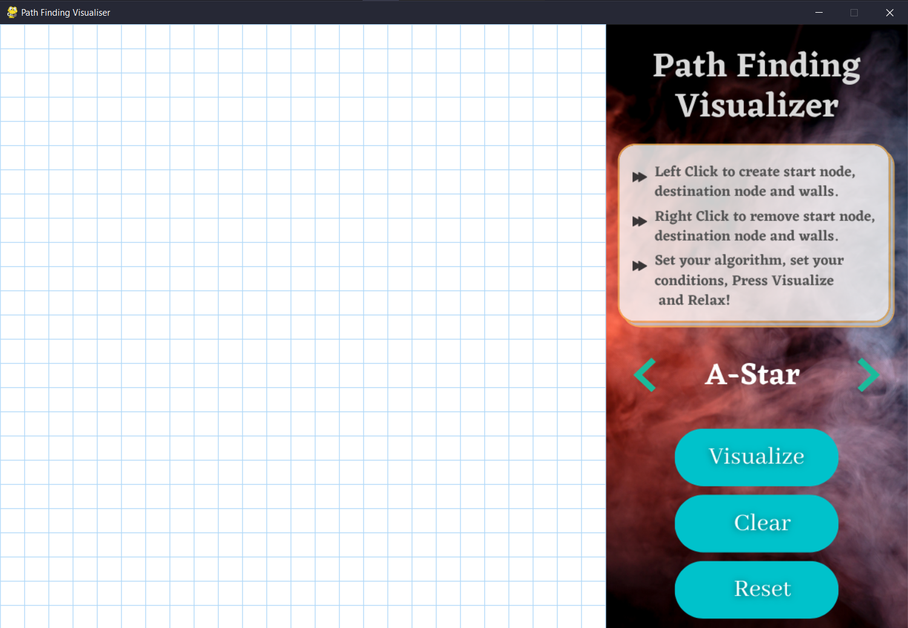
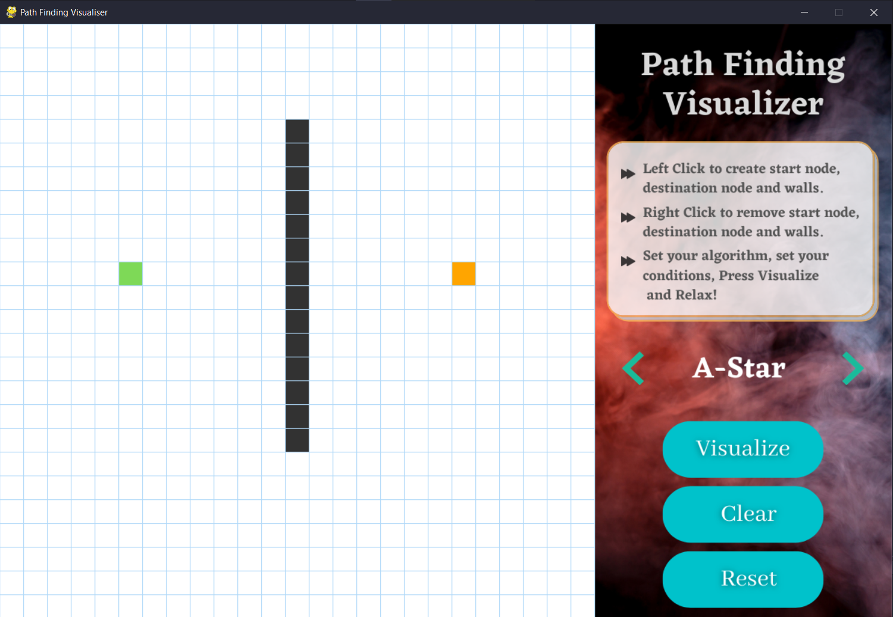
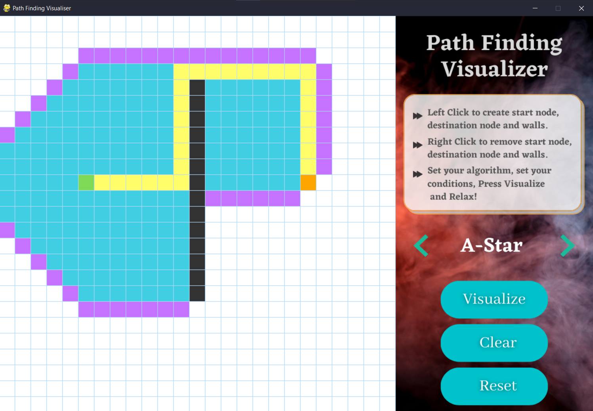
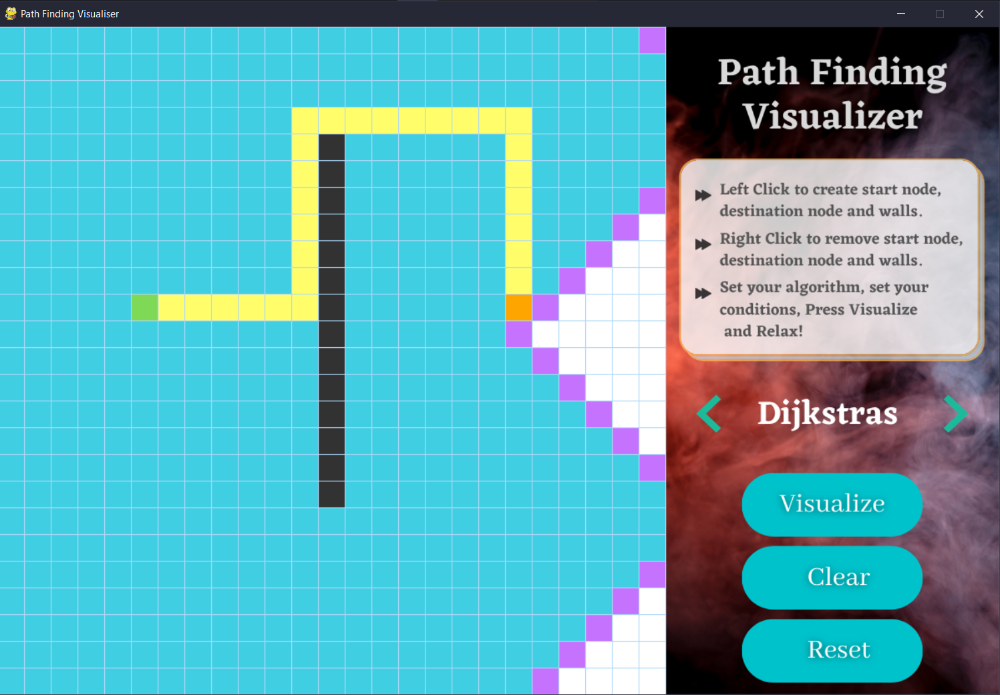
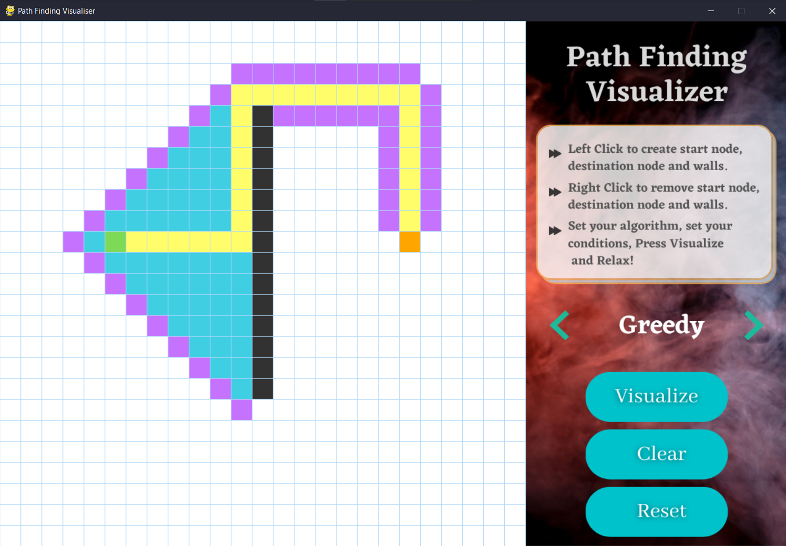

# Path Finding Visualizer


A  Python GUI App which visualizes path finding in pygame window.


**Algorithms Added**

 - ***[A-Star](https://github.com/karan0805/Path-Finding-Visualizer/new/master?readme=1#a-star)***
 - ***[Dijkstra](https://github.com/karan0805/Path-Finding-Visualizer/new/master?readme=1#dijkstra)***
 - ***[Greedy Best-First](https://github.com/karan0805/Path-Finding-Visualizer/new/master?readme=1#greedy-best-first)***

## Setup

##### Clone the repository

```bash
git clone https://github.com/karan0805/Path-Finding-Visualizer.git
```

##### Move to the desired folder

```bash
cd Path-Finding-Visualizer
```

##### To install the dependencies, simply write

```bash
pip install -r requirements.txt
```

##### To run the app, simply write

```bash
python main.py
```
## Screenshots
#### UI



#### A-Star


#### Dijkstra


#### Greedy Best-First


[](https://github.com/karan0805/Path-Finding-Visualizer/issues) 
[](https://github.com/karan0805/Path-Finding-Visualizer) 

[](https://github.com/karan0805/Path-Finding-Visualizer) 
[](https://github.com/karan0805/Path-Finding-Visualizer)


### If you encounter any difficulty running it, feel free to contact on my email :smile:

### If you liked our work do give us a star :star::star::star: It Encourages us to do more :wink: :dizzy:
